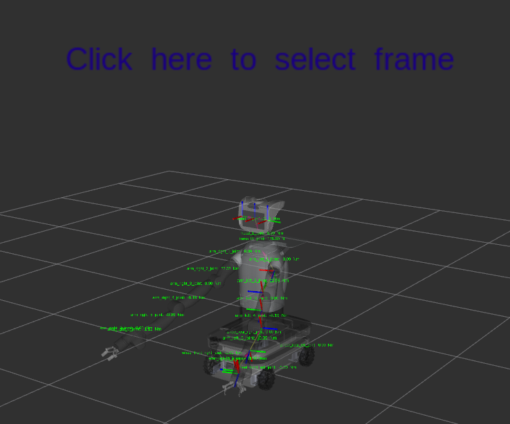
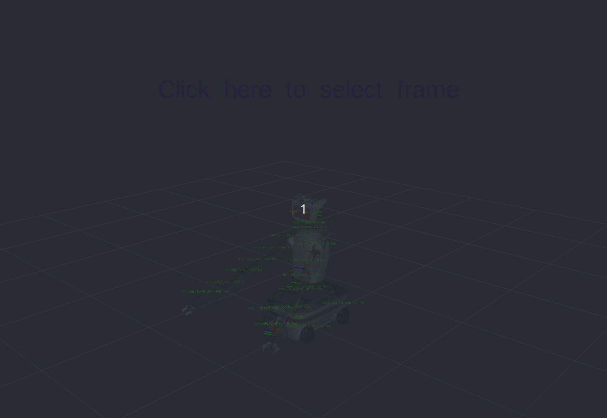
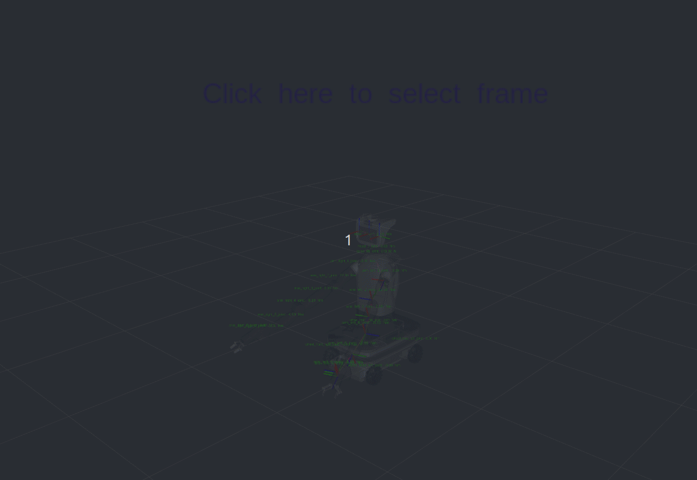
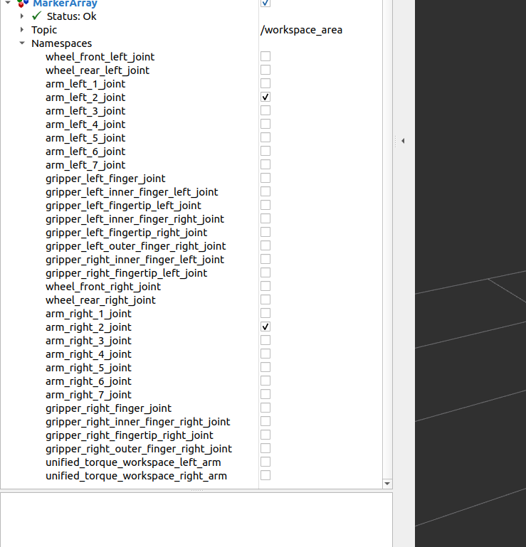
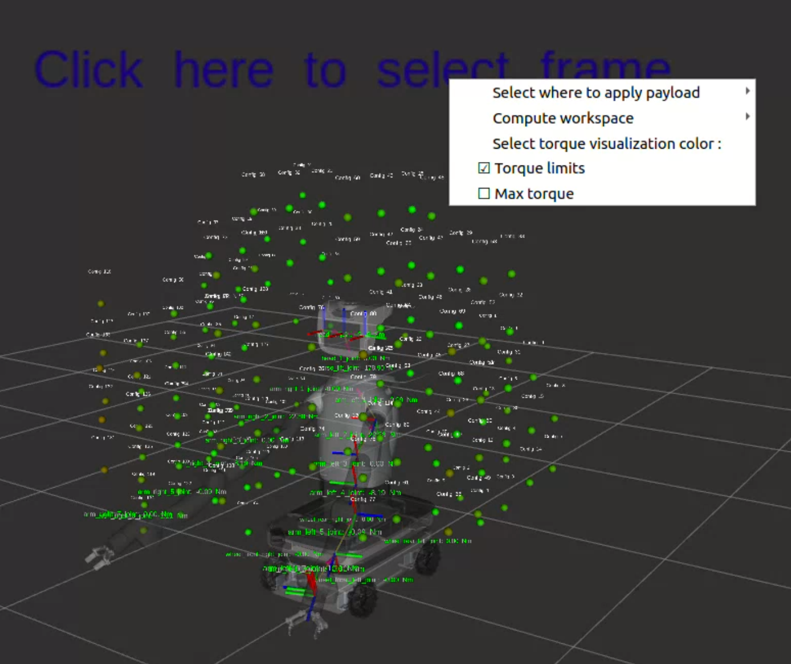
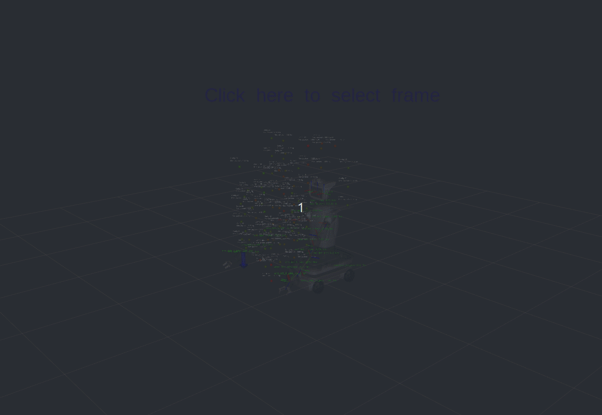
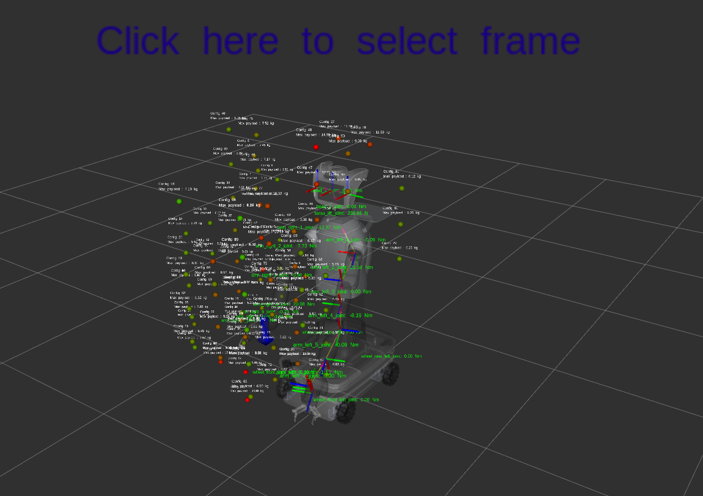
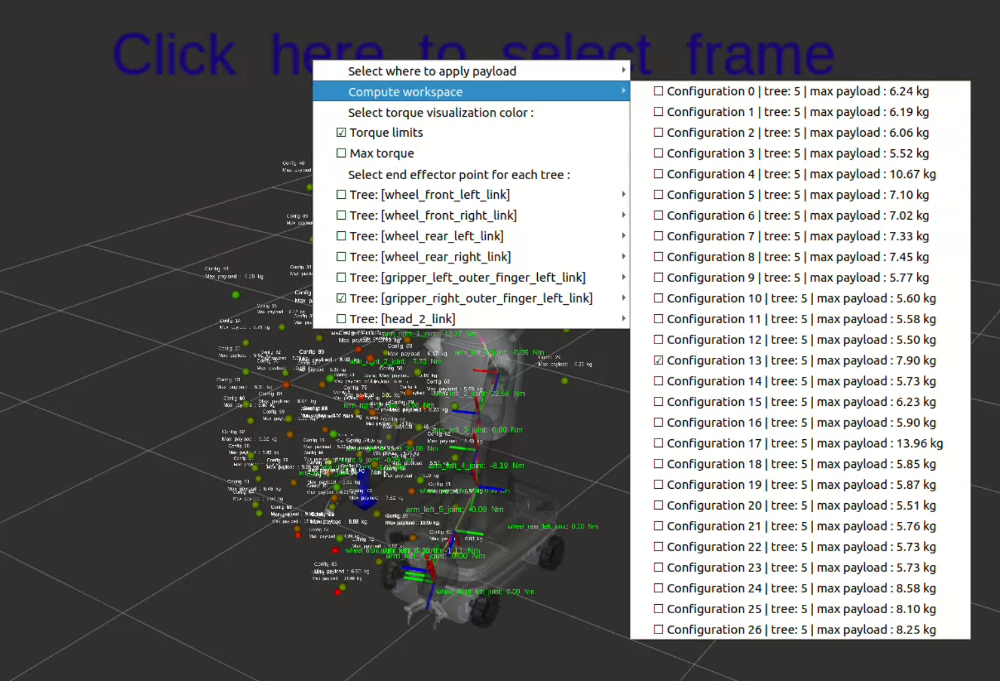

# Documentation

## Requirements and dependencies
This package is tested with ROS 2 Humble and it requires **Pinocchio** library to be installed. You can install it using tutorials available at [Pinocchio Installation](https://github.com/stack-of-tasks/pinocchio?tab=readme-ov-file#ros)

## Compiling from source
To install the package, clone the repository into your ROS 2 workspace and build it using `colcon`. Make sure to install all dependencies using rosdep before building the package.

```bash
cd ~/your_ros2_workspace/src
git clone https://github.com/pal-robotics/dynamic_payload_analysis.git
cd ~/your_ros2_workspace
rosdep install --from-paths src --ignore-src -r -y
```

After installing dependencies, build the package:

```bash
colcon build --packages-select dynamic_payload_analysis_ros dynamic_payload_analysis_core
```

# Usage
To use the dynamic payload analysis, you can run the following command to start the node:

```bash
ros2 run dynamic_payload_analysis_ros node_rviz_visualization_menu
```

Otherwise, you can launch the node using the provided launch file:

```bash
ros2 launch dynamic_payload_analysis_ros dyn_payload_analysis.launch.py
```

### Advanced parameters
The ros2 node has some advanced parameters that can be set in the launch command. 
1. **advanced_mode** parameter, which allows you to add a payload to any link in the kinematic tree of the selected end effector link. If this parameter is set to false, you can only add a payload to the end effector link.

2. **resolution_ik** parameter, which allows you to set the resolution of the inverse kinematics computation. The default value is 0.20 meters, but you can set it to a different value if needed.

3. **workspace_range** parameter, which allows you to set the range of the workspace area to be analyzed. The default value is 2.0 meters, but you can set it to a different value if needed.


You can set the parameters in the launch command as follows:

```bash
ros2 launch dynamic_payload_analysis_ros dyn_payload_analysis.launch.py advanced_mode:=true resolution_ik:=0.20 workspace_range:=2.0
```

## Visualizing the results in RViz

In order to visualize the published objects in RViz, you can add the following markers:
- **/torque_visualization** *(visualization_msgs/MarkerArray)* : *topic for visualizing the torque of the joints as labels in RViz*

- **/workspace_area** *(visualization_msgs/MarkerArray)* : *topic for visualizing the workspace area as points with labels in RViz*
- **/external_forces** *(visualization_msgs/MarkerArray)* : *topic for visualizing the external forces as arrows in RViz*
- **/maximum_payloads** *(visualization_msgs/MarkerArray)* : *topic for visualizing the maximum payloads as points with labels in RViz*
- **/menu_frames** *(visualization_msgs/InteractiveMarker)* : *topic for visualizing the interactive marker menu in RViz*

After adding the markers, you'll be able to see a view similar to the one shown below:

<div style="text-align: center;">

</div>

Furthermore, the node publishes the joint states of the robot in the **/joint_states** topic, so you can visualize the joint states in RViz as well.
Make sure to remove other nodes that publish the joint states of the robot, as they can interfere with the visualization of the dynamic payload analysis.

### Calculating the workspace area
1) With a right click on the interactive markers, you can open a menu to select which kinematic chains you want to analyze by selecting the corresponding end effector link in the sub-menu. The menu will look like this:

<div style="text-align: center;">

</div>

2) After selecting the kinematic chains, you can add a payload to the end effector link or to any link in its kinematic tree (only if the advanced parameter is enabled), as shown below:

<div style="text-align: center;">

</div>

3) After selecting the end effector link and adding a payload, you can compute the workspace area by clicking on the **Compute workspace** button in the interactive markers menu.

4) After computing the workspace, you'll be able to see the valid configurations in Rviz as points and labels, as shown in the image below:

<div style="text-align: center;">

</div>

# Visualization logic
The position of visualized points represents the selected end points (link) of the robot kinematic chains and the color of the point represents the amount of torque based on different target torque. <br>
The script publishes a point for each joint of the selected kinematic chains, so in order to visualize only the color of a specific joint you can select only the namespace related to that joint in the interactive markers menu, as shown below:
<div style="text-align: center;">

</div>

The script allow you to visualize the colors of the joints with different target torques:
- **Torque joint limits** : the colors are based on the joint limits provided by the URDF file
- **Maximum current torque** : the colors are based on the maximum current torques of the joints in the current payloads configuration


You can select the target torque in the interactive markers menu, as shown below:

<div style="text-align: center;">

</div> 


## Colors legend
- **Green** : the joint torque is close to zero or the minimum current torque
- **Yellow** : the joint torque is close to the middle of the limits or the maximum current torque
- **Red** : the joint torque is close to the maximum joint torque or the maximum current torque

### Unified torque workspace tree
Furthermore, if you want to visualize the more stressed configurations in terms of joint torques, you can select the namespace **unified_torque_workspace_tree_numbertree** in the topic **/workspace_area**. This will visualize the workspace area with colors gradient based on the sum of the joint torques for each configuration, so the more stressed configurations will be visualized with red points and the less stressed configurations will be visualized with green points.

## Displaying of allowed configurations
The script allows you to visualize the allowed configurations of the robot arms in the workspace area. To select one of the allowed configurations, you can choose the configuration from the sub-menu of the **Compute workspace** button, as shown below:

<div style="text-align: center;">

</div>

Each point in the workspace area is labeled with its configuration number, which matches the configuration number in the sub-menu of the **Compute workspace** button.

## Computing the maximum payloads
The script calculates the maximum payloads for the selected end effector link and its kinematic tree. The computation is done together with the workspace area computation, so you can compute the maximum payloads by clicking on the **Compute workspace** button in the interactive markers menu.
The maximum payloads are visualized as points published in the **/maximum_payloads** topic, and they are displayed in RViz as shown below:

<div style="text-align: center;">

</div>

Furthermore, the maximum payloads for each valid configuration are displayed in the sub-menu of the **Compute workspace** button, as shown below: 

<div style="text-align: center;">

</div>

# Tutorials for different robots
- [Tiago pro](tutorials/tiago_pro_tutorial.md)
- [Talos](tutorials/talos_tutorial.md)
- [Unitree H1](tutorials/H1_tutorial.md)
- [Franka Robot](tutorials/franka_tutorial.md)
- [UR_robots](tutorials/ur_robots_tutorial.md)


