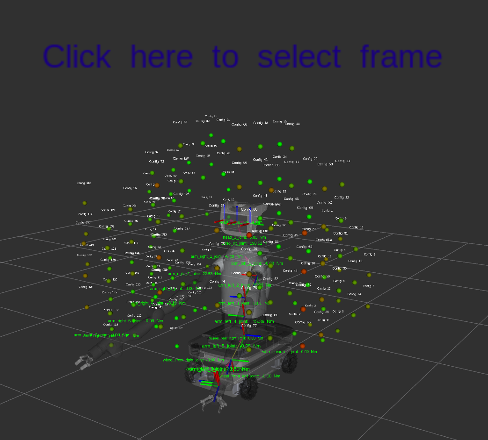

# Documentation

## Installation
The package requires **Pinocchio** library to be installed. You can install it using tutorials available at [Pinocchio Installation](https://github.com/stack-of-tasks/pinocchio?tab=readme-ov-file#ros)


## Usage
After building the package, in order to use the dynamic payload analysis, you can run the following command:

```bash
ros2 run dynamic_payload_analysis_ros node_rviz_visualization_menu
```

In order to visualize the published objects in RViz, you can add the following markers:
- MarkerArray : **/torque_visualization**
- MarkerArray : **/workspace_area**
- MarkerArray : **/workspace_area_names**
- InteractiveMarkers : **/menu_frames**

After adding the markers, you'll be able to see a view similar to the one shown below:

<div style="text-align: center;">

</div>

### Calculating the workspace area
1) With a right click on the interactive markers, you can open a menu to select payloads and choose the position where to apply them. The menu will look like this:

<div style="text-align: center;">

</div>

2) After selecting the payloads, you can calculate and visualize the workspace area and the valid configurations with the button **"Compute workspace"**

3) After computing the workspace, you'll be able to see the valid configurations in Rviz as points and labels, as shown in the image below:

<div style="text-align: center;">

</div>

## Visualization legends and rules
The position of visualized points represents the end points of the robot arms and the color of the point represents the amount of torque based on different target torque. <br>
The script publishes a point for each joint of the robot arms, so in order to visualize only the color of a specific joint you can select only the namespace related to that joint in the interactive markers menu, like shown below:
<div style="text-align: center;">

</div>

The script allow to visualize the colors of the joints with different target torques:
- **Joint limits** : the colors are based on the joint limits provided by the URDF file
- **Maximum current torque** : the colors are based on the maximum current torques of the joints in the current payloads configuration


You can select the target torque in the interactive markers menu, like shown below:

<div style="text-align: center;">

</div> 


