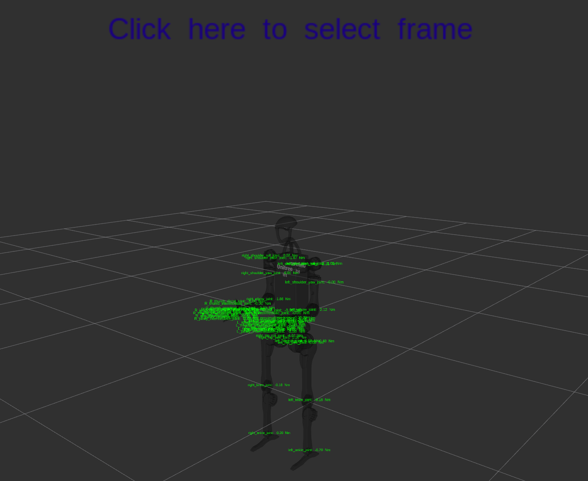
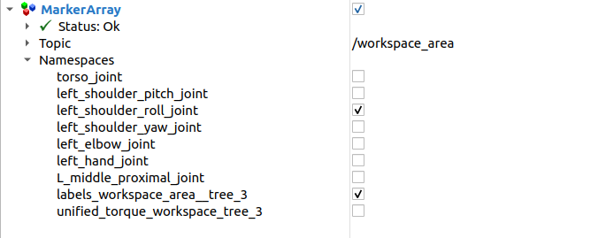
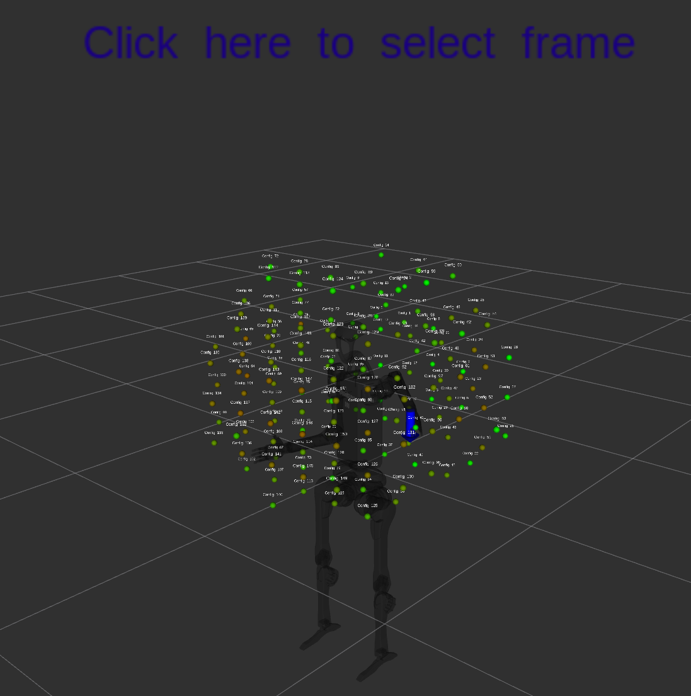

# Unitree H1 Tutorial
This tutorial provides a guide on how to use the dynamic payload analysis for the **Unitree H1 robot**. It covers the visualization of workspace areas, joint torques, and maximum payloads.

# Prerequisites
Ensure you have the Unitree H1 robot's URDF file and the necessary ROS packages installed using rosdep.

# Setting Up the Environment
1. In the dynamic_payload_analysis_ros package, there is a launch file that allows you to visualize the dynamic payload analysis in RViz for the Unitree H1 robot. You can run the following command to launch the node:
    ```bash
    ros2 launch dynamic_payload_analysis_ros dyn_analysis_payload_unitree_h1.launch.py
    ```
    *If you want to modify the available parameters for the dynamic analysis, you can set them in the launch command. The available parameters are:*

    - advanced_mode: If set to true, allows adding a payload to any link in the kinematic tree of the selected end effector link. If false, you can only add a payload to the end effector link.
    - resolution_ik: Sets the resolution of the inverse kinematics computation. Default is 0.20 meters, but you can set it to a different value if needed.*(Remember: with lower values the computational time will increase a lot)*
    - workspace_range: Sets the range of the workspace area to be analyzed. Default is 2.0 meters, but you can set it to a different value if needed.

2. After launching Rviz, you'll be able to see a view similar to the one shown below:
   <div style="text-align: center;">
   
   </div>

    **Note**: Make sure to have as fixed frame the **pelvis** of the robot, so you can visualize the markers correctly.

# Analyzing the Workspace Area
1. Right-click on the interactive markers to open a menu where you can select which kinematic chains you want to analyze by selecting the corresponding end effector link in the sub-menu.
    For H1, the main kinematic chains are:
    - **leg_left**: Left leg kinematic chain.
    - **leg_right**: Right leg kinematic chain.
    - **arm_left**: Left arm kinematic chain.
    - **arm_right**: Right arm kinematic chain.
        ```mermaid
        graph TD;
            A[pelvis] --> B[left_hip_yaw_link];
            B --> C[left_hip_roll_link];
            C --> D[left_hip_pitch_link];
            D --> E[left_knee_link];
            E --> F[left_ankle_link];
            A[pelvis] --> G[right_hip_yaw_link];
            G --> H[right_hip_roll_link];
            H --> I[right_hip_pitch_link];
            I --> J[right_knee_link];
            J --> K[right_ankle_link];
            A[pelvis] --> L[torso_link];
            L --> M[left_shoulder_pitch_link];
            M --> N[left_shoulder_roll_link];
            N --> O[left_shoulder_yaw_link];
            O --> P[left_elbow_link];
            P --> Q[left_hand_link];
            L --> R[right_shoulder_pitch_link];
            R --> S[right_shoulder_roll_link];
            S --> T[right_shoulder_yaw_link];
            T --> U[right_elbow_link];
            U --> V[right_hand_link];
        ```
    
    *Note: in the interactive markers menu, there will be more kinematic chains available because the structure of the robot has more kinematic chains in the hands, but this is not relevant for the dynamic payload analysis.*

2. After selecting the kinematic chains, you can add a payload to the end effector link or to any link in its kinematic tree (only if the advanced parameter is enabled). This step is not necessary, if you just want to visualize the workspace area without adding a payload.

3. By clicking on the **Calculate Workspace Area** button in the interactive marker menu, the node will start computing the workspace area for the selected end effector links. The computational time depends on the complexity of the kinematic chain and the level of resolution set in the parameters.

4. After the computation is finished, the workspace will be visualized in RViz as points with labels, representing the reachable positions of the selected end effector links. In order to have a better visualization, it is recommended to enable only one topic between **/workspace_area** and **/maximum_payloads** at a time. 

    When visualizing the workspace area, to analyze the requirement for a specific joint, you can select the corresponding namespace in the interactive markers menu.  

    <div style="text-align: center;">
    
    </div>
    In the image above, you can see the namespaces for the left arm joints, where each namespace has points representing the reachable positions of the end effector link selected in the right arm kinematic chain, and the color of the points represents the amount of torque for that joint in the different reachable positions.

    The image below shows the workspace area for the left arm kinematic chain, with the end effector link set to **left_hand_link**. The points are colored based on the torque required for the **left_shoulder_roll_joint** with the torque limits as target values.
    <div style="text-align: center;">
    
    </div>

