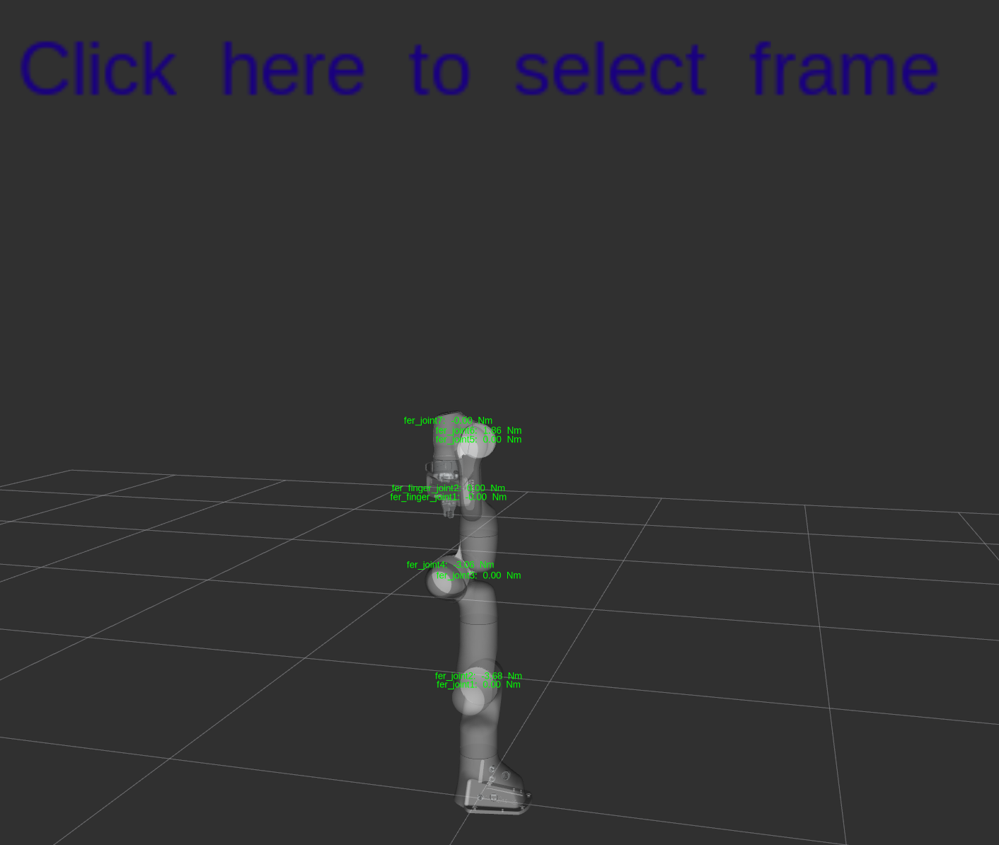
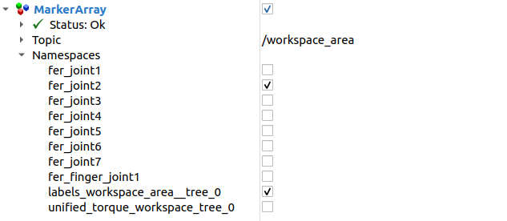

# Tiago Pro Tutorial
This tutorial provides a guide on how to use the dynamic payload analysis for the **Franka robotic arm**. It covers the visualization of workspace areas, joint torques, and maximum payloads.

# Prerequisites
Ensure you have the Franka robot's URDF file and the necessary ROS packages installed and built in the same workspace of the package **dynamic_payload_analysis_core**.
You can find the necessary URDF files in the corrisponding repository: [Franka URDF](https://github.com/frankarobotics/franka_description)

# Setting Up the Environment
1. Launch the dynamic payload analysis node:
    ```bash
    ros2 run dynamic_payload_analysis_ros node_rviz_visualization_menu
    ```
    *If you want to use the advanced parameters, you can set them in the launch command as follows:*

    ```bash
    ros2 run dynamic_payload_analysis_ros node_rviz_visualization_menu --ros-args -p advanced_mode:=true -p resolution_ik:=0.10
    ```
    - advanced_mode: If set to true, allows adding a payload to any link in the kinematic tree of the selected end effector link. If false, you can only add a payload to the end effector link.
    - resolution_ik: Sets the resolution of the inverse kinematics computation. Default is 0.20 meters, but you can set it to a different value if needed.*(Remember: with lower values the computational time will increase a lot)*
    
2. Launch the Tiago Pro robot description and RViz using the following command:
    ```bash
    ros2 launch franka_description visualize_franka.launch.py arm_id:=fer
    ```
    **Note:** This launch file will start also the joint state publisher, which is not needed for the dynamic payload analysis because the node publishes the joint states of the robot. You can remove the joint state publisher from the launch file if you want to avoid conflicts.

3. After opening RViz, you can add the following topics to visualize the results:
   - **/torque_visualization**: MarkerArray for visualizing the torque of the joints as labels in RViz.
   - **/workspace_area**: MarkerArray for visualizing the workspace area as points with labels in RViz.
   - **/external_forces**: MarkerArray for visualizing the external forces as arrows in RViz.
   - **/maximum_payloads**: MarkerArray for visualizing the maximum payloads as points with labels in RViz.
   - **/menu_frames**: InteractiveMarkers for visualizing the interactive marker menu in RViz.

4. After adding the markers, you'll be able to see a view similar to the one shown below:
   <div style="text-align: center;">
   
   </div>

    **Note**: Make sure to have as fixed frame the **base** of the robot, so you can visualize the markers correctly.

# Analyzing the Workspace Area
1. Right-click on the interactive markers to open a menu where you can select which kinematic chains you want to analyze by selecting the corresponding end effector link in the sub-menu.
    For Franka robot, the main kinematic chain is:
    - **arm**: Arm kinematic chain, with the following possible end effector links:
        - **fer_link_1**
        - **fer_link_2**
        - **fer_link_3**
        - **fer_link_4**
        - **fer_link_5**
        - **fer_link_6**
        - **fer_link_7**
        - **fer_leftfinger**

2. After selecting the kinematic chains, you can add a payload to the end effector link or to any link in its kinematic tree (only if the advanced parameter is enabled). This step is not necessary, if you just want to visualize the workspace area without adding a payload.

3. By clicking on the **Calculate Workspace Area** button in the interactive marker menu, the node will start computing the workspace area for the selected end effector links. The computational time depends on the complexity of the kinematic chain and the level of resolution set in the parameters.

4. After the computation is finished, the workspace will be visualized in RViz as points with labels, representing the reachable positions of the selected end effector links. In order to have a better visualization, it is recommended to enable only one topic between **/workspace_area** and **/maximum_payloads** at a time. 

    When visualizing the workspace area, to analyze the requirement for a specific joint, you can select the corresponding namespace in the interactive markers menu.  

    <div style="text-align: center;">
    
    </div>
    In the image above, you can see the namespaces for the arm joints, where each namespace has points representing the reachable positions of the end effector link selected in the right arm kinematic chain, and the color of the points represents the amount of torque for that joint in the different reachable positions.

